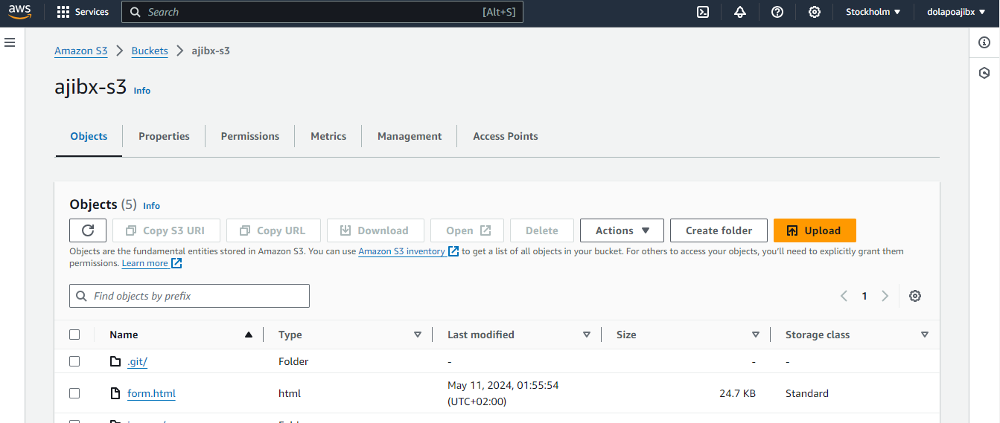
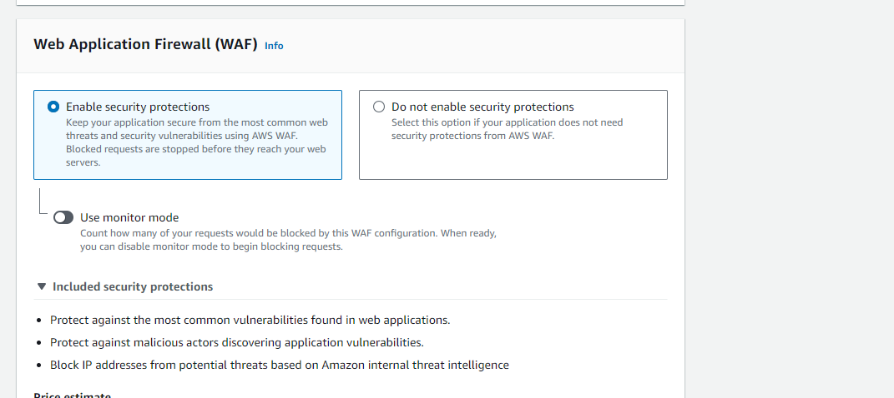

# Private S3 bucket static website using CloudFront 

## `Instruction:`

> Create a static website and host it on S3 bucket(private bucket) but with public read policy assigned, using cloud front for CDN.

## Steps:

## `s3 Bucket setup`

- Firstly, login to your AWS account and search for `s3` in the searchbox

- Click `s3` and click on `create bucket`

- Input a unique name for your bucket and leave everything else as default and click on `create bucket` on the bottom of the screen.

- On the next page,click on the bucket name then click on the icon `upload` and click add folder to upload your website files

- After successfully uploading, click on the folder name to view its content, select all files, then go to `action` dropdown and move all files to the root folder (bucket name).

## `Next is to ssetup our cloudfront`

- Go to Searchbox and search CloudFront, then click on it.

- Click on create new distribution. 

- Input domain name. After selecting your bucket name scroll down to `Origin access` and select `Origin access control settings(recommended)` to create a new origin access control OAC and scroll down to enable security. Then click `create distribution`

- After CloudFront distribution has been created. Click on `Copy Policy`

- Then go back to S3 console and go to s3 bucket permissions tab. Scroll down to bucket policy and click `edit` and paste policy into the textbox

- Then back to the created CloudFront distribution to copy your `distribution domain name`

- Paste on a new tab to view our website.

